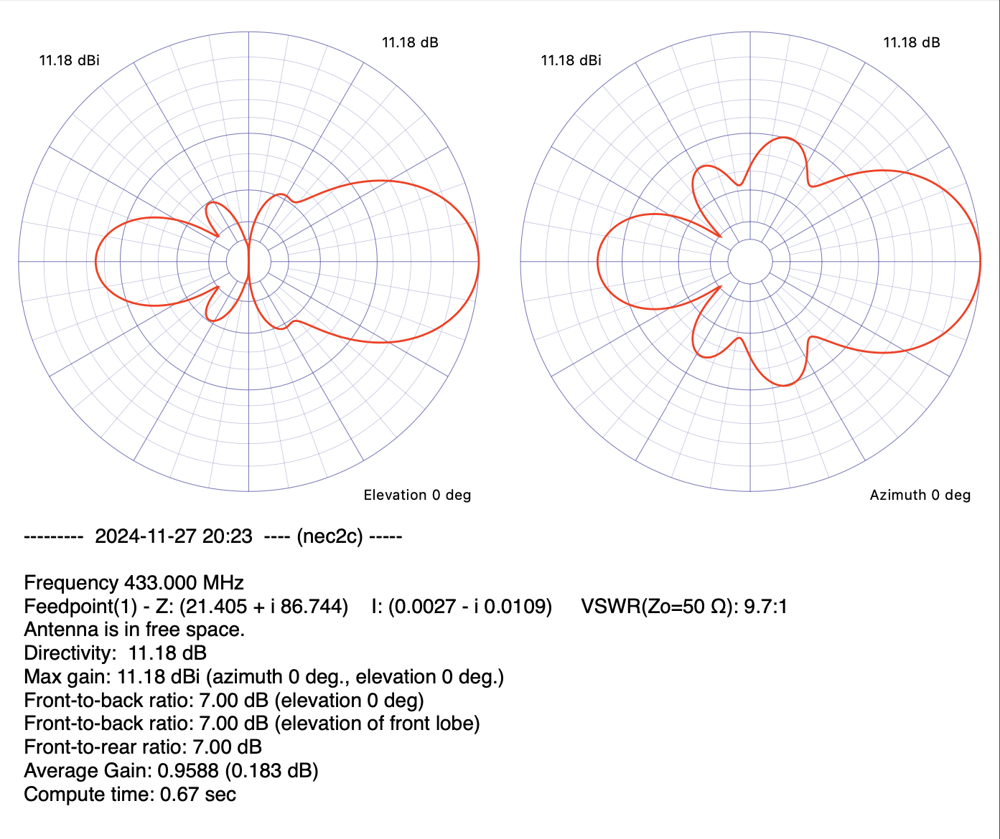

# Forest transmittion

It's just an experiment, I wanna see if I can design an antenna that will transmit signal to a forest nearby.  
The forest is in front of my window, elevated significantly (probably around 50-60 meters above my window).  
Between my balcony and the peak of the forest is around 400m and a lot of obstacles in between buildings same size as mine and trees obviously).  
But from what I've seen it seems that there should be LOS condition.  
Because of that and to reduce the number of factor that I need to focus on, I assume free space conditions for the time being.  
Once I'll design the first version of antenna, I'll start analysing it from more nuanced perspective of propagation conditions.  

Current state:  

 

# Evolution Algorithm

After initial design in CocoaNEC 2.0 I realized that there's a lot of degrees of freedom and although it is quite satisfying to twich them and see how gain increases, I thought there's something even more satisfying - writing a task that will calculate it for me. When walking in forest I was wondering if I should try to implement it with RL or NN, or Program Synthesis, but I thought the first two would be pretty heavy, while the last one - I'm not competent enough to even figure out how to conceptualize it.  
But after [being forced out of Racket](docs/gpt-cocoa-to-nec2cpp-conversion.md), I thought it's an excellent opportunity to learn Evolution Algorithms, it's a perfect task for that. So, my starting point is this GPT generated version (python) of my NEC output from CocoaNEC. I'm assuming that a couple of parameters will be the static - frequency and dipole position, but number of directors and sizes of all wires will be lose (just constrained to some extend).  

So, what are prerequisites:
- pip install necpp
